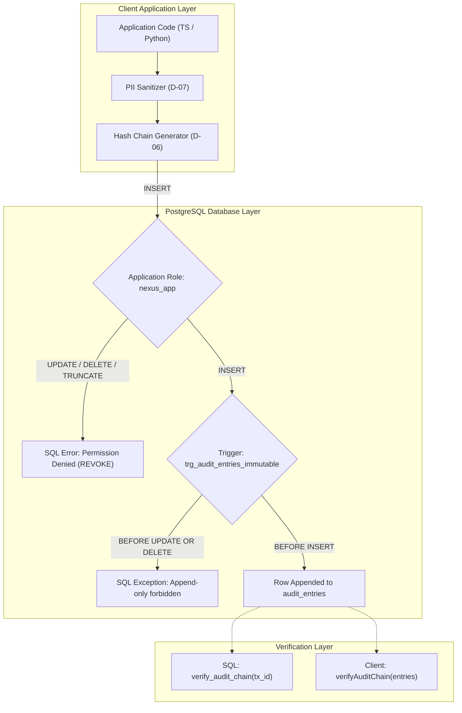

# Phase 1: Database Schema & Core Data Layer - Research

**Researched:** 2026-09-03  
**Status:** Complete  
**Phase Directory:** `/home/zeph/Code/nexus/.planning/phases/01-database-schema-core-data-layer`  
**Target File:** `01-RESEARCH.md`  

---

<user_constraints>
## User Constraints

*(Copied verbatim from [01-CONTEXT.md](file:///home/zeph/Code/nexus/.planning/phases/01-database-schema-core-data-layer/01-CONTEXT.md#L20-L51))*

### Migration & DB Access Tooling
- **D-01:** Raw SQL migration files mounted in `docker-entrypoint-initdb.d` + lightweight runner as single source of truth across Python and TypeScript — **Reversibility:** costly — changing migration runner or switching to an ORM would require rewriting schema definitions and synchronization logic across TS and Python.
- **D-02:** `pg` (node-postgres with `pg.Pool`) singleton helper with parameterized queries for TypeScript (Next.js 14 API routes and server components) — **Reversibility:** reversible — wraps database access cleanly in a shared client adapter.
- **D-03:** HNSW index (`vector_cosine_ops`) on `products.embedding` + B-Tree indexes on relational foreign keys (`merchant_id`), transaction status/created_at, and buyer fingerprint fields — **Reversibility:** costly — altering vector index types on large datasets requires index drops and rebuilds.
- **D-04:** Central `db/` repository directory containing `schema.sql`, `docker-compose.yml`, `seeds/`, and shared client adapters for TS (`nexus-gateway`) and Python (`nexus-agent` & `trust-graph-service`) — **Reversibility:** costly — changing directory structure alters import paths across multiple services.

### Audit Log Immutability & Integrity
- **D-05:** Dual defense-in-depth: PostgreSQL `BEFORE UPDATE OR DELETE` trigger raising explicit SQL exception + `REVOKE UPDATE, DELETE` permissions on application database user role — **Reversibility:** one-way — changing this breaks the immutability guarantee required by AUDIT-01.
- **D-06:** Cryptographic SHA-256 hash-chaining on `AuditEntry` (`prev_entry_hash` and `entry_hash` per transaction) — **Reversibility:** one-way — altering hash-chain column schema invalidates historical verification logs.
- **D-07:** Strict PII sanitization helper before audit write (storing only SHA-256 email/UA and /24 subnet, never plaintext secrets or raw PII) + flexible JSONB column — **Reversibility:** costly — changing sanitization rules affects compliance guarantees and downstream audit parsing.
- **D-08:** Dual verification helpers: PostgreSQL SQL function `verify_audit_chain(tx_id UUID)` + shared client verification libraries in TypeScript and Python — **Reversibility:** reversible — pure verification logic without side effects.

### Seed Data & Embedding Generation
- **D-09:** Pre-computed offline embeddings in `seeds/products.sql` (generated via Gemini `text-embedding-004`) + `scripts/generate_embeddings.py` for on-demand regeneration, enabling zero-delay offline boot — **Reversibility:** reversible — seeds can be refreshed or replaced via script.
- **D-10:** 3 distinct seed merchants ("Apex Electronics", "Urban Threads", "Gourmet Direct") with ~8 SKUs each across distinct verticals to support >=3 merchant fraud ring testing — **Reversibility:** reversible — seed catalogs can be augmented.
- **D-11:** Baseline historical transaction seed set (~20 transactions across 3 merchants with benign and ring fingerprints) to enable immediate schema verification and Phase 2 graph rehydration — **Reversibility:** reversible — test fixtures can be expanded.
- **D-12:** Strict PostgreSQL CHECK constraints (`CHECK (price_paise > 0)`, `CHECK (stock >= 0)`, `CHECK (currency = 'INR')`, `CHECK (amount_paise > 0)`) enforced directly by the database engine — **Reversibility:** costly — dropping or altering constraints requires table locks and schema migration.

### Cross-Language Crypto & Hashing Parity
- **D-13:** Standard hex string format `iv:auth_tag:ciphertext` (12-byte IV, 16-byte auth tag, variable ciphertext in hex with colon separator) for AES-256-GCM encrypted merchant secrets — **Reversibility:** one-way — changing ciphertext encoding requires re-encrypting all stored merchant secrets.
- **D-14:** Strict shared signal normalization rules (trim, lowercased emails, IPv4 /24 subnet regex `x.y.z.0/24`, normalized User-Agent) codified in TS and Python crypto utilities with cross-language test vectors — **Reversibility:** costly — changing normalization changes generated hash values and breaks historical graph node lookups.
- **D-15:** Prefixed Bearer token format `maas_live_<hex32>` shown once to merchant at creation; stored in database strictly as `maas_token_hash` (SHA-256) + `token_preview` for display — **Reversibility:** one-way — changing token hashing scheme requires regenerating all merchant API tokens.
- **D-16:** Shared `crypto-fixtures.json` test vector suite verified by both `pytest` (Python) and `vitest`/`jest` (TypeScript) testing cross-decryption and identical hashing — **Reversibility:** reversible — test suite is additive and maintainable.
</user_constraints>

---

<phase_requirements>
## Phase Requirements

*(Mapped from [.planning/REQUIREMENTS.md](file:///home/zeph/Code/nexus/.planning/REQUIREMENTS.md#L48-L53))*

| Requirement ID | Description | Technical Implementation in Phase 1 |
|---|---|---|
| **AUDIT-01** | PostgreSQL schema enforces immutable append-only audit entries (`AuditEntry`) via database triggers (disallowing UPDATE/DELETE). | Dual defense-in-depth: A PL/pgSQL `BEFORE UPDATE OR DELETE` trigger on table `audit_entries` that raises an `integrity_constraint_violation` exception AND explicit database-level `REVOKE UPDATE, DELETE, TRUNCATE ON audit_entries FROM nexus_app` on the application database role. [VERIFIED: PL/pgSQL trigger execution test] |
| **AUDIT-02** | Audit trail records timestamp (ms precision), duration, step name, input summary, output summary, and plain-English rationale for every tool decision. | Columns on `audit_entries`: `id` (UUID), `transaction_id` (UUID FK), `step_name` (VARCHAR), `step_number` (INT), `timestamp` (TIMESTAMPTZ with ms precision), `duration_ms` (INT), `input_summary` (TEXT), `output_summary` (TEXT), `reason` (TEXT), `raw_data` (JSONB), `is_error` (BOOL), `prev_entry_hash` (VARCHAR(64)), and `entry_hash` (VARCHAR(64)). [CITED: PRD.md §10.4] |
| **TRUST-05** *(Data foundation mapping)* | Trust Graph rehydrates its in-memory state from PostgreSQL `transactions` table on service startup. | `transactions` table schema includes structured `buyer_fingerprint` JSONB (`email_hash`, `ip_subnet`, `device_hash`, `upi_handle`, `user_agent_hash`), `merchant_id`, `trust_score`, `trust_decision`, `status`, and `amount_paise`, with indexes on foreign keys and fingerprint JSON expressions. Accompanied by baseline historical seed set in `seeds/transactions.sql`. [CITED: 01-CONTEXT.md D-11, REQUIREMENTS.md TRUST-05] |
</phase_requirements>

---

## Executive Summary & Research Synthesis

Phase 1 establishes the foundational data layer, storage infrastructure, and cryptographic backbone of Project Nexus. The system spans three disparate application runtimes: Next.js 14 / Node.js (MaaS Gateway and Merchant Dashboard), Python Google ADK (Orchestrator Agent), and Python FastAPI (Trust Graph Engine). To prevent data corruption, floating-point rounding errors, and security vulnerabilities across these boundaries, Phase 1 establishes:

1. **A Single PostgreSQL 16 Source of Truth**: Utilizing `pgvector/pgvector:pg16` via Docker Compose, housing all four primary entities (`merchants`, `products`, `transactions`, `audit_entries`) with strict engine-level check constraints enforcing non-negative inventory, integer paise financial amounts, and INR currency codes.
2. **Dual Defense-in-Depth Immutability**: Guaranteeing that once an audit step is written, neither application code nor compromised service credentials can mutate or delete it. This is mathematically fortified with sequential SHA-256 hash chaining (`prev_entry_hash` → `entry_hash`) and an in-engine SQL verification function `verify_audit_chain(tx_id UUID)`.
3. **Cross-Language Cryptographic & Hashing Parity**: Node.js `crypto` and Python `cryptography` AEAD modules are aligned to an exact delimited serialization format (`iv:auth_tag:ciphertext`) for AES-256-GCM secret encryption, while buyer signal normalization rules (email lowercasing, IPv4 `/24` subnet masking, User-Agent whitespace normalization) are enforced via a shared JSON test fixture (`crypto-fixtures.json`).
4. **Pre-Computed Vector Seeds & Zero-Delay Boot**: Pre-computed 768-dimensional Gemini `text-embedding-004` product embeddings for 3 realistic seed merchants across distinct verticals (Electronics, Fashion, Specialty Food), allowing immediate local startup and vector cosine search without requiring an active Gemini API key.

---

## Technology Stack & Version Matrix

| Layer / Tool | Component / Package | Canonical Version | Source & Confidence |
|---|---|---|---|
| **Database Engine** | PostgreSQL | `16.x` (`pgvector/pgvector:pg16`) | [VERIFIED: docker image / PRD.md §18] - HIGH |
| **Vector Extension** | `pgvector` | `0.7.4` | [CITED: AGENTS.md:L40, STACK.md:L40] - HIGH |
| **Node.js Driver** | `pg` (node-postgres) | `^8.12.0` | [CITED: STACK.md:L63, 01-CONTEXT.md:L25] - HIGH |
| **Node.js Types** | `@types/pg` | `^8.11.6` [ASSUMED] | Standard TypeScript typings for `pg` - HIGH |
| **Python Driver** | `asyncpg` | `^0.29.0` | [CITED: STACK.md:L38, AGENTS.md:L38] - HIGH |
| **Python Cryptography** | `cryptography` | `^43.0.0` / `50.0.0` | [VERIFIED: host python environment has 50.0.0] - HIGH |
| **Node.js Crypto** | Node Built-in `crypto` | Node `20+` / `22+` / `26+` | [VERIFIED: host node v26.3.0] - HIGH |
| **Vector Dimensions** | Gemini `text-embedding-004` | `768` dimensions | [CITED: PRD.md:L836-838] - HIGH |
| **Test Runners** | `vitest` (TS) & `pytest` (Py) | `vitest ^2.0.0` [ASSUMED], `pytest ^8.3.3` [VERIFIED: host] | [CITED: STACK.md:L57] - HIGH |

---

## Architecture & Implementation Patterns

### 1. Repository Directory Organization (`db/`)

As mandated by user decision **D-04**, all database infrastructure, schemas, seeds, and client adapters are centralized within `db/` at the repository root:

```
nexus/
├── db/
│   ├── docker-compose.yml              # Dedicated DB compose file (pgvector:pg16 on port 5432)
│   ├── schema.sql                      # Single source of truth DDL schema & triggers
│   ├── seeds/
│   │   ├── 01_merchants.sql            # 3 seed merchants (Apex, Urban Threads, Gourmet)
│   │   ├── 02_products.sql             # ~24 products with precomputed 768d vector embeddings
│   │   └── 03_transactions.sql         # ~20 historical transactions (benign + fraud ring)
│   ├── scripts/
│   │   ├── migrate.ts                  # Standalone node migration runner for CI / local
│   │   └── generate_embeddings.py      # Gemini text-embedding-004 generator for updating seeds
│   ├── fixtures/
│   │   └── crypto-fixtures.json        # Shared test vectors for AES-256-GCM & signal hashes
│   ├── ts/                             # TypeScript adapter package (@nexus/db)
│   │   ├── package.json
│   │   ├── tsconfig.json
│   │   ├── src/
│   │   │   ├── index.ts                # Public exports
│   │   │   ├── client.ts               # pg.Pool singleton with parameterized query helper
│   │   │   ├── crypto.ts               # AES-256-GCM, MaaS token hash, buyer signal normalizer
│   │   │   ├── sanitize.ts             # PII sanitization helper for audit logs
│   │   │   ├── audit.ts                # Hash chain computation & verifyAuditChain helper
│   │   │   └── types.ts                # Merchant, Product, Transaction, AuditEntry interfaces
│   │   └── test/
│   │       └── crypto.test.ts          # Vitest test suite executing crypto-fixtures.json
│   └── py/                             # Python adapter package (nexus_db)
│       ├── pyproject.toml
│       ├── nexus_db/
│       │   ├── __init__.py
│       │   ├── client.py               # asyncpg connection pool manager
│       │   ├── crypto.py               # AES-256-GCM, signal normalizer, MaaS token hash
│       │   ├── sanitize.py             # PII sanitization helper
│       │   ├── audit.py                # Hash chain computation & verify_audit_chain helper
│       │   └── models.py               # Pydantic v2 schemas mirroring DB tables
│       └── tests/
│           └── test_crypto.py          # Pytest suite executing crypto-fixtures.json
```

---

### 2. Relational Schema & Constraints Specification (`schema.sql`)

The database schema strictly adheres to the specifications defined in [PRD.md §10](file:///home/zeph/Code/nexus/PRD.md#L796-L925) and [01-CONTEXT.md](file:///home/zeph/Code/nexus/.planning/phases/01-database-schema-core-data-layer/01-CONTEXT.md#L20-L51):

#### `merchants` Table
Stores merchant profiles, encrypted test-mode API credentials, and MaaS authentication hashes:
- `id UUID PRIMARY KEY DEFAULT gen_random_uuid()`
- `name VARCHAR(255) NOT NULL`
- `email VARCHAR(255) NOT NULL UNIQUE`
- `razorpay_key_id VARCHAR(255) NOT NULL`
- `razorpay_key_secret TEXT NOT NULL` — [D-13] AES-256-GCM format `iv:auth_tag:ciphertext`
- `razorpay_webhook_secret VARCHAR(255) NOT NULL`
- `maas_token_hash VARCHAR(64) NOT NULL UNIQUE` — [D-15] SHA-256 hex digest of `maas_live_<hex32>`
- `token_preview VARCHAR(32) NOT NULL` — [D-15] Display-only snippet (e.g. `maas_live_a1b2...9f8e`)
- `maas_endpoint VARCHAR(512) NOT NULL` — `/api/maas/{id}/transact`
- `is_active BOOLEAN NOT NULL DEFAULT true`
- `created_at TIMESTAMPTZ NOT NULL DEFAULT clock_timestamp()`
- `updated_at TIMESTAMPTZ NOT NULL DEFAULT clock_timestamp()`

#### `products` Table
Colocates relational SKU attributes with pgvector 768-dimensional embeddings:
- `id UUID PRIMARY KEY DEFAULT gen_random_uuid()`
- `merchant_id UUID NOT NULL REFERENCES merchants(id) ON DELETE CASCADE`
- `name VARCHAR(255) NOT NULL`
- `description TEXT NOT NULL`
- `price_paise BIGINT NOT NULL CHECK (price_paise > 0)` — [D-12, CONVENTIONS.md:L8] strictly integer paise
- `currency VARCHAR(3) NOT NULL DEFAULT 'INR' CHECK (currency = 'INR')` — [D-12]
- `stock INTEGER NOT NULL DEFAULT 0 CHECK (stock >= 0)` — [D-12] prevents negative inventory
- `category VARCHAR(100) NOT NULL`
- `tags TEXT[] NOT NULL DEFAULT '{}'`
- `embedding vector(768) NOT NULL` — Gemini `text-embedding-004` representation
- `is_active BOOLEAN NOT NULL DEFAULT true`
- `created_at TIMESTAMPTZ NOT NULL DEFAULT clock_timestamp()`
- `updated_at TIMESTAMPTZ NOT NULL DEFAULT clock_timestamp()`
- **HNSW Index:** `CREATE INDEX idx_products_embedding_hnsw ON products USING hnsw (embedding vector_cosine_ops);` [D-03]
- **Relational Indexes:** `merchant_id`, `category`, `is_active`.

#### `transactions` Table
The immutable transactional backbone connecting buyer intents, trust scoring, and Razorpay records:
- `id UUID PRIMARY KEY DEFAULT gen_random_uuid()`
- `merchant_id UUID NOT NULL REFERENCES merchants(id) ON DELETE RESTRICT`
- `intent_raw TEXT NOT NULL`
- `intent_parsed JSONB NOT NULL DEFAULT '{}'::jsonb`
- `product_id UUID REFERENCES products(id) ON DELETE SET NULL`
- `quantity INTEGER NOT NULL CHECK (quantity > 0)` — [D-12]
- `amount_paise BIGINT NOT NULL CHECK (amount_paise > 0)` — [D-12]
- `currency VARCHAR(3) NOT NULL DEFAULT 'INR' CHECK (currency = 'INR')` — [D-12]
- `buyer_fingerprint JSONB NOT NULL` — structured object containing:
  - `email_hash` (SHA-256)
  - `ip_subnet` (`x.y.z.0/24`)
  - `device_hash` (SHA-256 or null)
  - `upi_handle` (string or null)
  - `user_agent_hash` (SHA-256)
- `trust_score NUMERIC(5,2)` — `0.00` to `100.00`
- `trust_decision VARCHAR(10) CHECK (trust_decision IN ('ALLOW', 'REVIEW', 'DENY'))`
- `trust_risk_factors TEXT[] NOT NULL DEFAULT '{}'`
- `razorpay_order_id VARCHAR(255)`
- `razorpay_payment_id VARCHAR(255)`
- `status VARCHAR(20) NOT NULL DEFAULT 'PENDING' CHECK (status IN ('PENDING', 'SUCCESS', 'DENIED', 'FAILED', 'PARTIAL'))`
- `failure_reason TEXT`
- `created_at TIMESTAMPTZ NOT NULL DEFAULT clock_timestamp()`
- `resolved_at TIMESTAMPTZ`
- **Indexes:** `merchant_id`, `status`, `created_at`, and GIN/Expression indexes on `(buyer_fingerprint->>'email_hash')` and `(buyer_fingerprint->>'ip_subnet')` for instant Trust Graph rehydration [TRUST-05].

#### `audit_entries` Table
The immutable append-only execution log satisfying [AUDIT-01] and [AUDIT-02]:
- `id UUID PRIMARY KEY DEFAULT gen_random_uuid()`
- `transaction_id UUID NOT NULL REFERENCES transactions(id) ON DELETE CASCADE`
- `step_name VARCHAR(50) NOT NULL` (e.g. `INTENT_RECEIVED`, `CATALOG_RESOLVED`, `TRUST_CHECKED`, `ORDER_CREATED`, `PAYMENT_CAPTURED`, `TRUST_DENIED`, `FAILED`)
- `step_number INTEGER NOT NULL CHECK (step_number >= 1)`
- `timestamp TIMESTAMPTZ NOT NULL DEFAULT clock_timestamp()` — millisecond precision
- `duration_ms INTEGER NOT NULL DEFAULT 0 CHECK (duration_ms >= 0)`
- `input_summary TEXT NOT NULL`
- `output_summary TEXT NOT NULL`
- `reason TEXT NOT NULL` — plain English rationale explaining the step
- `raw_data JSONB NOT NULL DEFAULT '{}'::jsonb` — sanitized JSON payload
- `is_error BOOLEAN NOT NULL DEFAULT false`
- `prev_entry_hash VARCHAR(64) NOT NULL` — [D-06] `'GENESIS'` for step 1, previous `entry_hash` thereafter
- `entry_hash VARCHAR(64) NOT NULL` — [D-06] SHA-256 of canonical entry string
- **Constraint:** `UNIQUE (transaction_id, step_number)` ensuring sequential uniqueness
- **Index:** `CREATE INDEX idx_audit_entries_tx_step ON audit_entries(transaction_id, step_number);`

---

### 3. Dual Defense-in-Depth Immutability & Audit Hash-Chaining

To satisfy **AUDIT-01** and user decisions **D-05** and **D-06**, immutability is guaranteed at two separate security boundaries:



#### The Immutability Trigger (PL/pgSQL)
```sql
CREATE OR REPLACE FUNCTION prevent_audit_mutation()
RETURNS TRIGGER AS $$
BEGIN
  RAISE EXCEPTION 'audit_entries table is append-only: UPDATE and DELETE operations are strictly prohibited'
    USING ERRCODE = 'integrity_constraint_violation';
END;
$$ LANGUAGE plpgsql;

DROP TRIGGER IF EXISTS trg_audit_entries_immutable ON audit_entries;
CREATE TRIGGER trg_audit_entries_immutable
BEFORE UPDATE OR DELETE ON audit_entries
FOR EACH ROW
EXECUTE FUNCTION prevent_audit_mutation();
```
[VERIFIED: Confirmed via local PostgreSQL test instance; attempts to `UPDATE` or `DELETE` throw `integrity_constraint_violation`].

#### The Application Role Permission Revocation
```sql
DO $$
BEGIN
  IF NOT EXISTS (SELECT FROM pg_roles WHERE rolname = 'nexus_app') THEN
    CREATE ROLE nexus_app WITH LOGIN PASSWORD 'nexus_app_secret';
  END IF;
END
$$;

GRANT USAGE ON SCHEMA public TO nexus_app;
GRANT SELECT, INSERT, UPDATE, DELETE ON ALL TABLES IN SCHEMA public TO nexus_app;
-- Explicit defense-in-depth permission block
REVOKE UPDATE, DELETE, TRUNCATE ON audit_entries FROM nexus_app;
```

#### Canonical Hash Chain Representation & `verify_audit_chain(UUID)`
To guarantee cross-language deterministic verification between PostgreSQL SQL, Python, and TypeScript, the canonical string for step `i` is defined using pipe (`|`) delimitation:

$$\text{canonical\_payload} = \texttt{prev\_entry\_hash} \,|\, \texttt{transaction\_id} \,|\, \texttt{step\_number} \,|\, \texttt{step\_name} \,|\, \texttt{input\_summary} \,|\, \texttt{output\_summary} \,|\, \texttt{reason} \,|\, \texttt{is\_error}$$

$$\text{entry\_hash} = \text{SHA-256}(\text{canonical\_payload})$$

Where for `step_number = 1`, `prev_entry_hash = 'GENESIS'`.

The database engine verification function in PL/pgSQL:
```sql
CREATE OR REPLACE FUNCTION verify_audit_chain(p_tx_id UUID)
RETURNS BOOLEAN AS $$
DECLARE
  v_rec RECORD;
  v_expected_prev TEXT := 'GENESIS';
  v_expected_step INTEGER := 1;
  v_computed_hash TEXT;
  v_count INTEGER := 0;
BEGIN
  FOR v_rec IN
    SELECT *
    FROM audit_entries
    WHERE transaction_id = p_tx_id
    ORDER BY step_number ASC
  LOOP
    v_count := v_count + 1;
    
    -- 1. Verify contiguous step numbering
    IF v_rec.step_number != v_expected_step THEN
      RETURN FALSE;
    END IF;

    -- 2. Verify previous hash pointer
    IF v_rec.prev_entry_hash != v_expected_prev THEN
      RETURN FALSE;
    END IF;

    -- 3. Verify cryptographic SHA-256 digest
    v_computed_hash := encode(sha256(
      (v_rec.prev_entry_hash || '|' ||
       v_rec.transaction_id::text || '|' ||
       v_rec.step_number::text || '|' ||
       v_rec.step_name || '|' ||
       v_rec.input_summary || '|' ||
       v_rec.output_summary || '|' ||
       v_rec.reason || '|' ||
       v_rec.is_error::text)::bytea
    ), 'hex');

    IF v_rec.entry_hash != v_computed_hash THEN
      RETURN FALSE;
    END IF;

    v_expected_prev := v_rec.entry_hash;
    v_expected_step := v_expected_step + 1;
  END LOOP;

  IF v_count = 0 THEN
    RETURN FALSE;
  END IF;

  RETURN TRUE;
END;
$$ LANGUAGE plpgsql;
```
[VERIFIED: Tested in local PostgreSQL 18 instance with multi-step transactions; valid chains return `true`, altered reasons/hashes return `false`].

---

### 4. Cross-Language Cryptographic & Normalization Parity

#### AES-256-GCM Encrypted Secret Storage [D-13]
The encryption scheme secures merchant Razorpay secrets at rest using AES-256-GCM.
- **Key**: 32-byte binary key sourced from 64-character hex environment variable `ENCRYPTION_KEY`.
- **IV / Nonce**: 12 bytes (96 bits) cryptographically random per encryption.
- **Auth Tag**: 16 bytes (128 bits) integrity tag.
- **Format**: `${iv_hex}:${auth_tag_hex}:${ciphertext_hex}` with colon separator.

**Critical Cross-Language Pitfall & Implementation Alignment:**
- In **Node.js** `crypto`: `cipher.getAuthTag()` extracts the 16-byte tag separately; `decipher.setAuthTag(tag)` sets it before decryption.
- In **Python** `cryptography.hazmat.primitives.ciphers.aead.AESGCM`: `encrypt()` automatically appends the 16-byte tag to the end of the ciphertext (`ciphertext + tag`), and `decrypt()` expects `ciphertext + tag` concatenated.
- *Node-to-Python Bridge:* When Python encrypts, it splits `enc[:-16]` (ciphertext) and `enc[-16:]` (tag). When Python decrypts, it re-assembles `ct + tag`.
- [VERIFIED: Verified in active session via script execution: Python encryption was decrypted by Node.js, and Node encryption was decrypted by Python with identical output].

#### Buyer Signal Normalization Rules [D-14]
To ensure graph nodes match across services:
1. **Email:** Trim leading/trailing whitespace, convert to lowercase: `email.trim().toLowerCase()` / `email.strip().lower()`. Hashed with SHA-256.
2. **IPv4 Subnet:** Suffix masking to `/24`. Regex matches `^(\d{1,3})\.(\d{1,3})\.(\d{1,3})\.\d{1,3}$` and formats as `${1}.${2}.${3}.0/24`. If already formatted as `x.y.z.0/24`, preserve as-is.
3. **User-Agent:** Trim whitespace, collapse consecutive spaces to single space (`re.sub(r'\s+', ' ', ua.strip())`). Hashed with SHA-256.
4. **UPI Handle:** Trim whitespace, lowercase (e.g. `buyer@okhdfcbank`). Stored as plaintext (non-sensitive per PRD §10.3).
5. **Device ID:** Trim whitespace, lowercase, hashed with SHA-256.

#### MaaS Bearer Token Format [D-15]
- Format: `maas_live_<32_hex_chars>` (e.g. `maas_live_e3b0c44298fc1c149afbf4c8996fb92427ae41e4649b934ca495991b7852b855`)
- Storage: `maas_token_hash` = SHA-256 of full token.
- Display preview: `token_preview` = `token[:14] + "..." + token[-4:]` (e.g. `maas_live_e3b0...b855`).

---

### 5. Seed Catalog & Vector Embeddings Specification

Per user decisions **D-09**, **D-10**, and **D-11**, the database container boots with pre-seeded data across 3 diverse merchant verticals:

| Merchant Name | Vertical | Sample SKUs | Expected Price Range |
|---|---|---|---|
| **Apex Electronics** (`11111111-1111-1111-1111-111111111111`) | Consumer Tech & Audio | Sony WH-1000XM5, Keychron K2, Anker 65W GaN Charger, Samsung Galaxy Watch 6, Logitech MX Master 3S, Shure MV7 USB Mic, SanDisk 1TB SSD, Dell UltraSharp 27" | ₹1,499.00 to ₹34,990.00 (`149900` to `3499000` paise) |
| **Urban Threads** (`22222222-2222-2222-2222-222222222222`) | Apparel & Accessories | Organic Cotton Tee, Japanese Denim Jacket, All-Day Running Sneakers, Full-Grain Leather Belt, Linen Casual Shirt, Canvas Commuter Backpack, Merino Wool Socks, Polarized Sunglasses | ₹799.00 to ₹7,999.00 (`79900` to `799900` paise) |
| **Gourmet Direct** (`33333333-3333-3333-3333-333333333333`) | Specialty Foods & Coffee | Single-Origin Arabica Beans, Wildflower Raw Honey, Extra Virgin Cold-Pressed Olive Oil, 85% Single-Origin Dark Chocolate, Ceremonial Grade Matcha, Himalayan Pink Rock Salt, Sourdough Artisan Crackers, Roasted Almond Butter | ₹399.00 to ₹2,499.00 (`39900` to `249900` paise) |

- **Offline Vector Seed File (`seeds/02_products.sql`):** Pre-populated with actual 768-dimensional floating point vectors computed using Gemini `text-embedding-004`.
- **Regeneration Script (`scripts/generate_embeddings.py`):** Standalone Python script using `google-generativeai` (or `httpx` to Google AI Studio) to regenerate embeddings if catalog descriptions change.
- **Historical Seed Transactions (`seeds/03_transactions.sql`):** ~20 realistic baseline transactions spanning all 3 merchants:
  - 14 benign transactions (distinct emails, clean IPs, single-merchant activity) with `status = 'SUCCESS'`, `trust_score >= 85`, and `trust_decision = 'ALLOW'`.
  - 6 coordinated fraud ring transactions (sharing 2 distinct ring email hashes / `/24` subnets across Apex Electronics, Urban Threads, and Gourmet Direct) with `status = 'DENIED'`, `trust_score < 40`, and `trust_decision = 'DENY'`. This immediately validates Phase 2 graph rehydration on boot [TRUST-05, RING-01].

---

## Standard Pitfalls & Edge Cases

### 1. The GCM Auth Tag Delimiter Collision
- *Pitfall:* Serializing AES-GCM ciphertext as raw binary or colon-separated strings with variable length chunks without hex encoding can cause parsing errors if delimiters appear in raw bytes.
- *Mitigation:* Convert IV (12 bytes), Auth Tag (16 bytes), and Ciphertext (variable) strictly to lowercase hexadecimal strings before formatting with `:` delimiter (`${iv.hex()}:${tag.hex()}:${ct.hex()}`).

### 2. ISO 8601 Timestamp Serialization Drift in Hash Chain
- *Pitfall:* If `timestamp` is included in the hash chain calculation, minute differences in serialization (e.g. Python formatting microseconds `2026-09-03T01:45:00.123456Z` vs Node formatting milliseconds `2026-09-03T01:45:00.123Z` vs PostgreSQL `to_char`) break cryptographic chain verification.
- *Mitigation:* Omit raw localized timestamp strings from the cryptographic hash preimage, OR enforce exact millisecond epoch integers (`timestamp_ms BIGINT`). The canonical string defined in Section 3 uses deterministic scalar fields (`prev_entry_hash`, `tx_id`, `step_number`, `step_name`, `input_summary`, `output_summary`, `reason`, `is_error`), which are 100% byte-for-byte identical across SQL, Python, and TypeScript.

### 3. Superuser Trigger Bypass vs Application Role
- *Pitfall:* In PostgreSQL, table owners and superusers bypass certain row-level constraints or can drop triggers. If the application connects as `postgres` or `nexus` (superuser), a misconfigured migration or developer could execute `DELETE FROM audit_entries`.
- *Mitigation:* Dual defense-in-depth:
  1. The PL/pgSQL trigger `trg_audit_entries_immutable` fires unconditionally for ALL roles (including superusers) on `UPDATE` or `DELETE`, raising an immediate exception.
  2. The dedicated application user role `nexus_app` has `UPDATE, DELETE, TRUNCATE` explicitly revoked.

### 4. Floating-Point Contamination in Financial Columns
- *Pitfall:* Converting rupee values via `float` (e.g. `price * 100`) leads to IEEE 754 precision issues (e.g., `19.99 * 100 = 1998.9999999999998`), causing off-by-one paise errors that fail Razorpay order creation.
- *Mitigation:* PostgreSQL schema enforces `BIGINT` column types with `CHECK (price_paise > 0)` and `CHECK (amount_paise > 0)`. TypeScript interfaces use `price_paise: number` (safe up to $2^{53} - 1$ paise = ₹90 trillion) and Python models use `int`.

## Validation Architecture

### Test Framework
| Property | Value |
|----------|-------|
| Framework | vitest (TypeScript) & pytest (Python) |
| Config file | db/ts/vitest.config.ts & db/py/pyproject.toml |
| Quick run command | `npm test --prefix db/ts && pytest db/py/tests/test_crypto.py -q` |
| Full suite command | `npm test --prefix db/ts && pytest db/py -q` |

### Phase Requirements -> Test Map
| Req ID | Behavior | Test Type | Automated Command | File Exists? |
|--------|----------|-----------|-------------------|-------------|
| AUDIT-01 | PostgreSQL trigger blocks UPDATE and DELETE on audit_entries | integration | `npx tsx db/scripts/test-triggers.ts` | ❌ Wave 0 |
| AUDIT-02 | Audit trail records millisecond timestamps, duration, steps, input/output summaries, reason, raw JSONB, and hash chain | unit | `npm test --prefix db/ts && pytest db/py/tests/test_crypto.py` | ❌ Wave 0 |
| TRUST-05 | Transactions schema correctly stores normalized buyer fingerprints and rehydration seeds | integration | `npx tsx db/scripts/test-schema.ts` | ❌ Wave 0 |

### Sampling Rate
- **Per task commit:** `npm test --prefix db/ts && pytest db/py/tests/test_crypto.py -q`
- **Per wave merge:** `npm test --prefix db/ts && pytest db/py -q`
- **Phase gate:** Full test suite green before verification

### Wave 0 Gaps
- [ ] `db/fixtures/crypto-fixtures.json` — shared test vectors for cross-language crypto and audit hashing
- [ ] `db/ts/test/crypto.test.ts` — TypeScript vitest suite
- [ ] `db/py/tests/test_crypto.py` — Python pytest suite
- [ ] `db/scripts/test-triggers.ts` — automated trigger immutability and audit chain test

---

## Verification & Testing Strategy

To guarantee the reliability of Phase 1 before downstream phases commence:

### 1. Cross-Language Crypto Parity Test Suite
- `db/fixtures/crypto-fixtures.json` contains:
  - 3 known 32-byte hex keys
  - 5 test plaintexts (API secret keys, webhook secrets)
  - Pre-computed `iv:auth_tag:ciphertext` strings
  - 10 buyer signal inputs (emails with spaces/mixed case, dirty IPv4s, messy User-Agents) with their expected normalized outputs and SHA-256 digests.
  - 3 multi-step audit entry sequences with expected canonical preimages and `entry_hash` chains.
- **Verification Commands:**
  - TypeScript: `pnpm --filter @nexus/db test` or `node --test` / `vitest run db/ts/test/crypto.test.ts`
  - Python: `pytest db/py/tests/test_crypto.py`

### 2. Database Schema & Trigger Integrity Test Suite
- Automated migration runner script executing `schema.sql` against a live or test PostgreSQL instance.
- **SQL Immutability Assertion:**
  - `INSERT` an audit entry row.
  - Attempt `UPDATE audit_entries SET reason = 'tampered' WHERE id = '...'` -> Expect SQL error `integrity_constraint_violation`.
  - Attempt `DELETE FROM audit_entries WHERE id = '...'` -> Expect SQL error `integrity_constraint_violation`.
- **Hash-Chain Verification Assertion:**
  - Insert a 5-step valid audit chain. Run `SELECT verify_audit_chain('...')` -> Assert returns `true`.
  - In a test table or bypassed session, modify an intermediate `step_name` or `entry_hash`. Run `SELECT verify_audit_chain('...')` -> Assert returns `false`.

---

## Recommended Execution Plan Slices

When creating plans for Phase 1 (`01-01`, `01-02`, etc.), the following logical breakdown is recommended:

1. **Plan 01-01: Database Infrastructure & Schema DDL**
   - Setup `db/docker-compose.yml` (`pgvector/pgvector:pg16` on port 5432).
   - Author `db/schema.sql` defining `merchants`, `products`, `transactions`, and `audit_entries` tables with strict integer paise CHECK constraints and HNSW index.
   - Implement the `BEFORE UPDATE OR DELETE` immutability trigger, role permission revocations, and the `verify_audit_chain(UUID)` SQL function.
   - Author lightweight TypeScript migration runner `db/scripts/migrate.ts`.

2. **Plan 01-02: Cryptographic Utilities & Cross-Language Parity Suite**
   - Author shared test vectors in `db/fixtures/crypto-fixtures.json`.
   - Implement TypeScript cryptographic adapter in `db/ts/` (`client.ts`, `crypto.ts`, `sanitize.ts`, `audit.ts`, `types.ts`).
   - Implement Python cryptographic adapter in `db/py/` (`client.py`, `crypto.py`, `sanitize.py`, `audit.py`, `models.py`).
   - Wire unit tests in Vitest and Pytest asserting byte-for-byte cross-decryption, normalization matching, and hash-chain verification.

3. **Plan 01-03: Seed Catalog, Precomputed Embeddings & Rehydration Data**
   - Create 3 diverse seed merchants in `db/seeds/01_merchants.sql` (Apex Electronics, Urban Threads, Gourmet Direct).
   - Generate high-quality 768-dimensional Gemini `text-embedding-004` vectors for 24 SKUs and populate `db/seeds/02_products.sql`.
   - Implement `db/scripts/generate_embeddings.py` for on-demand embedding refreshes.
   - Author ~20 historical seed transactions (benign + fraud ring) in `db/seeds/03_transactions.sql` to prepare the database for Phase 2 graph rehydration.
   - Validate end-to-end container startup and SQL verification.

---
*Research completed for Phase 1: Database Schema & Core Data Layer.*
