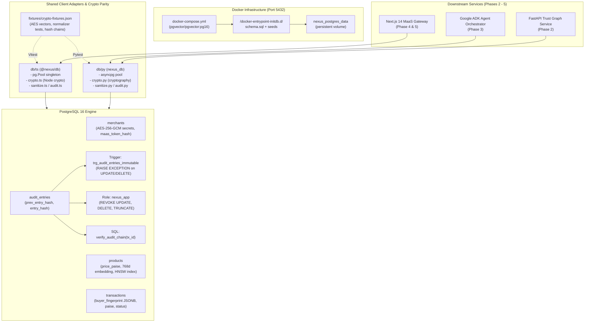

# Phase 1: Walking Skeleton Specification

**Created:** 2026-09-03  
**Phase:** 01-database-schema-core-data-layer  
**Status:** Active Architectural Blueprint  

---

## 1. Overview & Architectural Role

The Project Nexus Walking Skeleton establishes the thinnest viable end-to-end slice through the core system infrastructure:
1. **Containerized Database Engine**: PostgreSQL 16 with `pgvector` (`pgvector/pgvector:pg16`) running via Docker Compose on port 5432.
2. **Relational & Vector Data Model**: Single source-of-truth DDL (`db/schema.sql`) enforcing integer paise (`amount_paise`), non-negative inventory (`stock >= 0`), INR currency, and 768-dimensional vector cosine indexing via HNSW.
3. **Dual Defense-in-Depth Immutability**: Cryptographic SHA-256 hash chaining on `audit_entries` combined with a PL/pgSQL `BEFORE UPDATE OR DELETE` exception trigger AND application role permission revocation (`REVOKE UPDATE, DELETE, TRUNCATE`).
4. **Cross-Language Cryptographic Parity**: Identical AES-256-GCM secret encryption (`iv:auth_tag:ciphertext`) and buyer PII signal normalization (email trim/lowercase, IPv4 `/24` subnet truncation, UA collapsing) across TypeScript (`@nexus/db`) and Python (`nexus_db`).
5. **Zero-Delay Pre-Seeded Boot**: Pre-computed Gemini `text-embedding-004` vectors across 3 diverse merchants (Apex Electronics, Urban Threads, Gourmet Direct) and ~20 historical transactions to enable immediate Phase 2 Trust Graph rehydration without external API keys.

---

## 2. Walking Skeleton Architecture Diagram



---

## 3. Core Component Contracts

### 3.1 Docker Compose Specification (`db/docker-compose.yml`)
- **Image**: `pgvector/pgvector:pg16`
- **Container Name**: `nexus-postgres`
- **Ports**: `5432:5432`
- **Environment**:
  - `POSTGRES_DB=nexus`
  - `POSTGRES_USER=postgres`
  - `POSTGRES_PASSWORD=postgres`
- **Healthcheck**: `pg_isready -U postgres -d nexus` (interval: 5s, timeout: 5s, retries: 5)
- **Mounts**:
  - `nexus_postgres_data:/var/lib/postgresql/data`
  - `./schema.sql:/docker-entrypoint-initdb.d/01_schema.sql:ro`
  - `./seeds/:/docker-entrypoint-initdb.d/seeds/:ro`

### 3.2 Schema & Financial Integrity (`db/schema.sql`)
- **Money Model**: Strictly integer paise (`BIGINT NOT NULL CHECK (price_paise > 0)` and `CHECK (amount_paise > 0)`). Zero floating-point representation.
- **Currency**: `VARCHAR(3) NOT NULL DEFAULT 'INR' CHECK (currency = 'INR')`.
- **Vector Search**: `vector(768)` with HNSW index:
  ```sql
  CREATE INDEX idx_products_embedding_hnsw ON products USING hnsw (embedding vector_cosine_ops);
  ```
- **Sequential Audit Constraints**:
  ```sql
  CONSTRAINT uq_audit_entries_tx_step UNIQUE (transaction_id, step_number);
  ```

### 3.3 Defense-in-Depth Immutability (`db/schema.sql`)
1. **Engine-Level Trigger**:
   ```sql
   CREATE OR REPLACE FUNCTION prevent_audit_mutation()
   RETURNS TRIGGER AS $$
   BEGIN
     RAISE EXCEPTION 'audit_entries table is append-only: UPDATE and DELETE operations are strictly prohibited'
       USING ERRCODE = 'integrity_constraint_violation';
   END;
   $$ LANGUAGE plpgsql;

   CREATE TRIGGER trg_audit_entries_immutable
   BEFORE UPDATE OR DELETE ON audit_entries
   FOR EACH ROW
   EXECUTE FUNCTION prevent_audit_mutation();
   ```
2. **Role Permission Revocation**:
   ```sql
   CREATE ROLE nexus_app WITH LOGIN PASSWORD 'nexus_app_secret';
   GRANT USAGE ON SCHEMA public TO nexus_app;
   GRANT SELECT, INSERT, UPDATE, DELETE ON ALL TABLES IN SCHEMA public TO nexus_app;
   REVOKE UPDATE, DELETE, TRUNCATE ON audit_entries FROM nexus_app;
   ```
3. **In-Engine Chain Verifier**:
   - `verify_audit_chain(p_tx_id UUID) RETURNS BOOLEAN` executes sequential SHA-256 verification directly in SQL over canonical pipe-separated preimages.

### 3.4 Shared Cryptographic & Normalization Standard
- **AES-256-GCM Serialization**: `${iv_hex}:${auth_tag_hex}:${ciphertext_hex}`
  - IV: 12 bytes hex (24 chars)
  - Auth Tag: 16 bytes hex (32 chars)
  - Ciphertext: variable length hex
- **Buyer PII Signal Normalization**:
  - Email: `trim().toLowerCase()`, then SHA-256
  - IPv4: Mask to `/24` subnet (`x.y.z.0/24`)
  - User-Agent: Trim, collapse whitespace (`\s+` -> `' '`), then SHA-256
  - UPI Handle: `trim().toLowerCase()`, stored plaintext
- **MaaS Bearer Token**:
  - Live token: `maas_live_<32_hex_chars>`
  - Database hash: `maas_token_hash = sha256(token)`
  - Dashboard preview: `token_preview = token[0:14] + '...' + token[-4:]`

---

## 4. End-to-End Verification Pipeline

To verify that the Walking Skeleton is healthy and intact:
1. **Container Health**:
   ```bash
   docker compose -f db/docker-compose.yml ps
   # Must report 'nexus-postgres' as 'Up' and 'healthy'
   ```
2. **Schema & Trigger Test**:
   ```bash
   npx tsx db/scripts/test-triggers.ts
   # Must verify:
   # - INSERT on audit_entries succeeds
   # - UPDATE on audit_entries throws integrity_constraint_violation
   # - DELETE on audit_entries throws integrity_constraint_violation
   # - verify_audit_chain returns true for valid chains and false for tampered chains
   ```
3. **Cross-Language Crypto Parity**:
   ```bash
   npm test --prefix db/ts && pytest db/py/tests/test_crypto.py -q
   # Must pass 100% of crypto fixture assertions across both runtimes
   ```
4. **Seed Catalog & Vector Distance**:
   ```bash
   npx tsx db/scripts/test-schema.ts
   # Must verify 3 merchants, 24 products with 768d vectors, and baseline transactions
   ```
