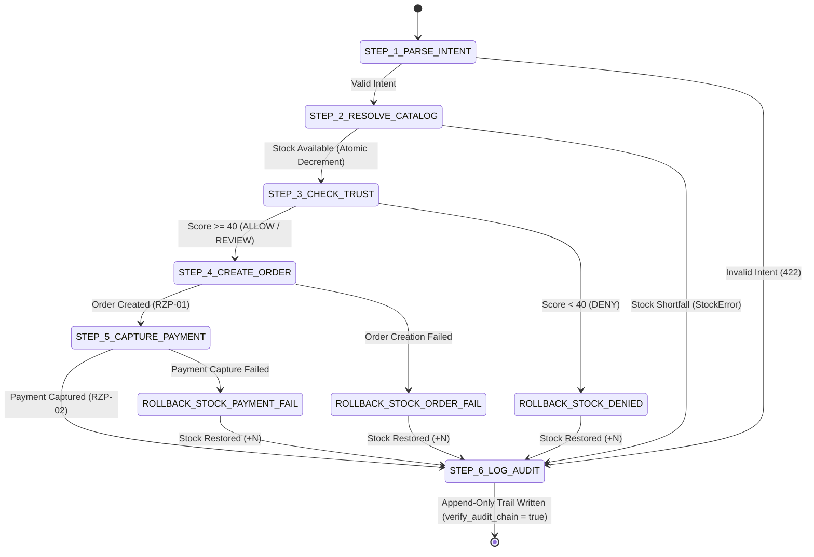

# Phase 03: Google ADK Orchestrator & Tool Suite - Research

**Domain:** Autonomous Agent Orchestration, Financial Tool Pipeline, and Gated Commerce Execution  
**Researched:** 2026-09-03  
**Confidence:** HIGH  

---

<user_constraints>

## User Constraints (from 03-CONTEXT.md)

### Phase Boundary
Phase 3 builds and validates the Google ADK Orchestrator Agent service (`nexus-agent`, port 8000) powered by Gemini 2.0 Flash (`gemini-2.0-flash`):
- Deterministic 6-step tool pipeline execution: `parse_intent` → `resolve_catalog` → `check_trust_graph` → `create_razorpay_order` → `capture_razorpay_payment` → `log_audit_entry` [VERIFIED: .planning/phases/03-google-adk-orchestrator-tool-suite/03-CONTEXT.md:10].
- Natural language intent parsing extracting `product_query`, integer `quantity`, and `buyer_email` with sub-2s latency [VERIFIED: .planning/phases/03-google-adk-orchestrator-tool-suite/03-CONTEXT.md:11].
- Merchant catalog resolution against PostgreSQL with atomic conditional inventory decrement and compensatory rollback on downstream denial or failure [VERIFIED: .planning/phases/03-google-adk-orchestrator-tool-suite/03-CONTEXT.md:12].
- Trust Graph client integration querying `http://localhost:8001/trust/score` with SHA-256 hashed buyer fingerprints, with soft-fail fallback to score 50 (REVIEW) on service timeout [VERIFIED: .planning/phases/03-google-adk-orchestrator-tool-suite/03-CONTEXT.md:13].
- Programmatic defense-in-depth gate in `create_razorpay_order` raising `TrustViolationError` if `trust_score < 40`, halting execution before any Razorpay API calls [VERIFIED: .planning/phases/03-google-adk-orchestrator-tool-suite/03-CONTEXT.md:14].
- Razorpay test-mode order creation and payment capture attaching `nexus_transaction_id`, `trust_score`, and product metadata to order notes, with dual-mode real SDK / mock client support [VERIFIED: .planning/phases/03-google-adk-orchestrator-tool-suite/03-CONTEXT.md:15].
- Comprehensive hash-chained append-only audit trail generation in PostgreSQL `audit_entries` on 100% of execution paths (success, denied, failed) with plain-English rationales [VERIFIED: .planning/phases/03-google-adk-orchestrator-tool-suite/03-CONTEXT.md:16].
- Port 8000 ADK-compatible runner endpoint (`POST /run`) [VERIFIED: .planning/phases/03-google-adk-orchestrator-tool-suite/03-CONTEXT.md:17].

### Core Decisions
- **D-01: Hybrid Parsing with Gemini 2.0 Flash & Deterministic Fallback** — `parse_intent` uses Gemini 2.0 Flash as the primary structured extractor for natural language intents, backed by a deterministic regex parser for standard commerce patterns (`Buy <N> <Product>`) and fuzzy catalog keyword matching. Quantity defaults to 1 if unspecified; quantities `<= 0` or `> 100` are rejected immediately as 422 Unprocessable Entity (`IntentValidationError`) [VERIFIED: .planning/phases/03-google-adk-orchestrator-tool-suite/03-CONTEXT.md:25].
- **D-02: Atomic Conditional Decrement with Compensatory Rollback** — `resolve_catalog` performs an atomic conditional decrement directly in PostgreSQL (`UPDATE products SET stock = stock - N WHERE id = $1 AND stock >= N RETURNING stock`), raising `StockError` if available stock is insufficient. If a subsequent step fails (e.g. Trust Graph DENY `< 40`, or Razorpay API error), the orchestrator executes an immediate compensatory increment rollback (`UPDATE products SET stock = stock + N WHERE id = $1`) before final audit logging [VERIFIED: .planning/phases/03-google-adk-orchestrator-tool-suite/03-CONTEXT.md:28].
- **D-03: Dual-Mode Razorpay Client Adapter with Mock Fallback** — Razorpay operations are abstracted behind a dual-mode client adapter: when active `rzp_test_*` credentials are present and network is available, it interacts with official `razorpay.Client`. A seamless `MockRazorpayClient` is automatically used when `NEXUS_RAZORPAY_MOCK=true` or when running unit tests offline, generating deterministic test order IDs and synthetic `pay_test_<hex>` payment capture records for server-to-server agentic flows without requiring browser interaction [VERIFIED: .planning/phases/03-google-adk-orchestrator-tool-suite/03-CONTEXT.md:31].
- **D-04: Deterministic Pipeline Runner with ADK FunctionTools** — A deterministic state machine pipeline runner controls step execution order (`1 -> 2 -> 3 -> 4 -> 5 -> 6`), guaranteeing zero step skipping, eliminating autonomous ReAct ordering hallucinations, and strictly enforcing the defense-in-depth gate (raising `TrustViolationError` at step 4 if `trust_score < 40`). Each step is wrapped as an ADK `FunctionTool`. Step 6 (`log_audit_entry`) is guaranteed to execute on all paths (success, denial, failure). The service exposes an ADK-compatible endpoint on port 8000 (`POST /run`) [VERIFIED: .planning/phases/03-google-adk-orchestrator-tool-suite/03-CONTEXT.md:34].

### The Agent's Discretion
- Internal directory structure of `nexus-agent/` (e.g. `nexus_agent/tools/`, `nexus_agent/pipeline/`, `nexus_agent/api/`, `nexus_agent/agents/`).
- Gemini prompt templates and extraction schemas for intent parsing.
- HTTP client configuration and retry/timeout policies for port 8001 Trust Graph service connection (`httpx` with 500ms timeout).

</user_constraints>

---

<phase_requirements>

## Phase Requirements Mapping

| Requirement ID | Description | Source | Architectural Mapping in Phase 3 |
|---|---|---|---|
| **ORCH-01** | Nexus Orchestrator Agent runs on Google ADK (`adk api_server` on port 8000) powered by Gemini 2.0 Flash with sub-2s tool-calling latency. | REQUIREMENTS.md:20 | `nexus_agent/agents/orchestrator/agent.py` exposes `root_agent = Agent(...)` for `adk api_server`; `nexus_agent/api/server.py` exposes ADK-compatible `POST /run` on port 8000. |
| **ORCH-02** | Agent executes strict 6-step deterministic pipeline: `parse_intent` → `resolve_catalog` → `check_trust_graph` → `create_razorpay_order` → `capture_razorpay_payment` → `log_audit_entry`. | REQUIREMENTS.md:21 | `nexus_agent/pipeline/runner.py` enforces step ordering 1 through 6, prohibiting skipping or reordering. |
| **ORCH-03** | Agent extracts structured `product_query`, integer `quantity`, and `buyer_email` from freeform intent via `parse_intent`. | REQUIREMENTS.md:22 | `nexus_agent/tools/intent.py` extracts fields with Gemini 2.0 Flash and deterministic regex fallback, validating quantity (defaults to 1; rejects `<= 0` or `> 100`). |
| **ORCH-04** | Agent validates inventory and decrements stock on successful transaction via `resolve_catalog` (halts on insufficient stock). | REQUIREMENTS.md:23 | `nexus_agent/tools/catalog.py` executes conditional SQL decrement (`stock = stock - N WHERE stock >= N`), raising `StockError` on shortfall; pipeline triggers compensatory rollback on downstream failure. |
| **ORCH-05** | Agent halts immediately on trust denial (score < 40) without invoking Razorpay API endpoints. | REQUIREMENTS.md:24 | `nexus_agent/pipeline/runner.py` evaluates Step 3 trust response; if `trust_score < 40`, pipeline immediately halts, rolls back stock, and executes Step 6 (`log_audit_entry`) with `status="DENIED"`. |
| **RING-03** | Programmatic defense-in-depth interceptor in `create_razorpay_order` raises `TrustViolationError` if called with trust score < 40. | REQUIREMENTS.md:38 | `nexus_agent/tools/razorpay.py` evaluates `if trust_score < 40:` and raises `TrustViolationError` before touching Razorpay client or creating orders. |
| **RZP-01** | Order tool creates Razorpay test-mode orders using merchant credentials with amount in integer paise and audit notes attached. | REQUIREMENTS.md:43 | `nexus_agent/tools/razorpay.py` creates orders via `RazorpayClientAdapter` with `amount_paise`, currency "INR", and notes containing `nexus_transaction_id`, `trust_score`, `product_id`, `quantity`. |
| **RZP-02** | Payment tool captures payments against created orders in test mode and records `razorpay_payment_id`. | REQUIREMENTS.md:44 | `nexus_agent/tools/razorpay.py` executes payment capture via `RazorpayClientAdapter`, returning payment ID (`pay_test_<hex>`), captured status, and timestamp. |

</phase_requirements>

---

## Architecture & Stack Analysis

### Technology Stack & Version Matrix

| Component | Package / Tool | Version | Purpose & Verification |
|---|---|---|---|
| **Agent Framework** | `google-adk` | `^2.8.0` (`2.8.0`) [VERIFIED: PyPI resolution in session] | Provides `google.adk.agents.Agent`, `google.adk.tools.FunctionTool`, and `adk api_server` CLI loader. |
| **LLM Inference** | `google-genai` / `google-generativeai` | `^0.8.6` (`0.8.6`) [VERIFIED: PyPI resolution in session] | Model `gemini-2.0-flash` for sub-2s structured intent extraction. |
| **Payment Gateway** | `razorpay` | `^2.0.1` (`2.0.1`) [VERIFIED: PyPI resolution in session] | Official Razorpay Python SDK for server-to-server order creation and payment capture. |
| **Async HTTP Client** | `httpx` | `0.28.1` [VERIFIED: installed in session environment] | Inter-service calls to Trust Graph Engine (`http://localhost:8001/trust/score`) with 500ms timeout. |
| **Database Driver** | `asyncpg` | `0.31.0` [VERIFIED: installed in session environment] | High-performance asynchronous binary protocol connection pool to PostgreSQL 16. |
| **Data Validation** | `pydantic` | `2.13.4` / `pydantic-settings 2.15.0` [VERIFIED: installed in session environment] | Pydantic v2 schemas for pipeline models, tool signatures, and ADK events. |
| **Cryptography** | `cryptography` | `50.0.1` [VERIFIED: installed in session environment] | AES-256-GCM merchant secret decryption and SHA-256 signal hashing. |
| **Shared DB Module** | `nexus_db` | in-repo (`db/py/nexus_db`) [VERIFIED: opened and verified in session] | Shared client pool, models, cryptographic functions, and audit chain hash helpers. |

### ADK API Server & Runner Architecture

The Google Agent Development Kit (`google-adk` 2.8.0) provides native CLI tooling and server components:
1. **Agent Discovery Contract:** `AgentLoader` [VERIFIED: `google.adk.cli.utils.agent_loader:AgentLoader`] discovers agents by scanning subdirectories inside `agents_dir`. When pointed to an agent directory (e.g. `agents/orchestrator`), it expects an `agent.py` file exposing a `root_agent = Agent(...)` object or `root_agent.yaml`.
2. **API Server Endpoint Contract:** `adk api_server` mounts a FastAPI application exposing:
   - `POST /run` accepting `RunAgentRequest` [VERIFIED: `google.adk.cli.api_server:RunAgentRequest:521`]:
     ```python
     class RunAgentRequest(BaseModel):
         app_name: str | None = None
         user_id: str
         session_id: str
         new_message: Content | None = None
         streaming: bool = False
         state_delta: dict[str, Any] | None = None
         invocation_id: str | None = None
         custom_metadata: dict[str, Any] | None = None
     ```
   - Returns a list of `Event` objects (`list[Event]`) containing tool calls, tool outputs, and model responses [VERIFIED: `google.adk.cli.api_server:1800`].
3. **Dual Execution Architecture (ADK + Deterministic State Machine):**
   - In accordance with Decision D-04 [VERIFIED: 03-CONTEXT.md:34], money movement cannot rely on autonomous, probabilistic ReAct loops which risk skipping steps, repeating orders, or reordering financial calls.
   - Therefore, `nexus-agent` implements a **Deterministic Pipeline Runner** (`nexus_agent.pipeline.runner:DeterministicPipelineRunner`) that explicitly executes Step 1 → Step 2 → Step 3 → Step 4 → Step 5 → Step 6.
   - Each step is wrapped as an ADK `FunctionTool` (`parse_intent`, `resolve_catalog`, `check_trust_graph`, `create_razorpay_order`, `capture_razorpay_payment`, `log_audit_entry`).
   - The `nexus_agent` service exposes `POST /run` matching the ADK request/response schema, routing execution through the deterministic pipeline runner, while also providing `root_agent` in `agents/orchestrator/agent.py` for standard ADK CLI invocation (`adk api_server`, `adk run`, `adk web`).

---

## Existing Code Patterns & Integration Points

### 1. In-Repo Value Provenance & Data Models

All data models and cryptographic utilities are imported directly from `db/py/nexus_db` [VERIFIED: `db/py/nexus_db/`]:

- **Buyer Fingerprint Schema** [VERIFIED: `db/py/nexus_db/models.py:7-15`]:
  ```python
  class BuyerFingerprintModel(BaseModel):
      model_config = ConfigDict(extra="ignore")
      email_hash: str
      ip_subnet: str
      device_hash: str | None = None
      upi_handle: str | None = None
      user_agent_hash: str
  ```
- **Intent Parsed Schema** [VERIFIED: `db/py/nexus_db/models.py:17-24`]:
  ```python
  class IntentParsedModel(BaseModel):
      model_config = ConfigDict(extra="ignore")
      product_query: str
      quantity: int
      buyer_email: str
      confidence: float
  ```
- **Transaction Status Constants** [VERIFIED: `db/py/nexus_db/models.py:74-78`]:
  ```python
  trust_decision: Literal["ALLOW", "REVIEW", "DENY"] | None = None
  status: Literal["PENDING", "SUCCESS", "DENIED", "FAILED", "PARTIAL"] = "PENDING"
  ```
- **Audit Entry Schema** [VERIFIED: `db/py/nexus_db/models.py:84-100`]:
  ```python
  class AuditEntryModel(BaseModel):
      id: UUID
      transaction_id: UUID
      step_name: str
      step_number: int = Field(ge=1)
      timestamp: datetime
      duration_ms: int = Field(ge=0, default=0)
      input_summary: str
      output_summary: str
      reason: str
      raw_data: dict[str, Any] = Field(default_factory=dict)
      is_error: bool = False
      prev_entry_hash: str
      entry_hash: str
  ```
- **PostgreSQL Immutability Trigger Error** [VERIFIED: `db/schema.sql:99-100`]:
  `RAISE EXCEPTION 'audit_entries table is append-only: UPDATE and DELETE operations are strictly prohibited' USING ERRCODE = 'integrity_constraint_violation';`
- **Audit Hash Chain Preimage Format** [VERIFIED: `db/py/nexus_db/audit.py:11-29`]:
  `prev_entry_hash|transaction_id|step_number|step_name|input_summary|output_summary|reason|is_error`
  - Step 1: `prev_entry_hash = "GENESIS"` [VERIFIED: `db/py/nexus_db/audit.py:53`]
  - Step N: `prev_entry_hash = Step N-1 entry_hash` [VERIFIED: `db/py/nexus_db/audit.py:74`]
  - Hash algorithm: `hashlib.sha256(preimage.encode("utf-8")).hexdigest()` [VERIFIED: `db/py/nexus_db/audit.py:35`]
- **AES-256-GCM Ciphertext Format** [VERIFIED: `db/py/nexus_db/crypto.py:31`]:
  `f"{iv.hex()}:{tag.hex()}:{ciphertext.hex()}"`
  Decryption function: `decrypt_secret(payload: str, key_hex: str) -> str` [VERIFIED: `db/py/nexus_db/crypto.py:34-49`].
- **Audit Data Sanitization** [VERIFIED: `db/py/nexus_db/sanitize.py:38-66`]:
  `sanitize_audit_data(data)` redacts `razorpay_key_secret` and `password` to `"[REDACTED]"`, hashes buyer emails, device IDs, and User-Agents via SHA-256, and masks IP addresses to `/24` subnets.

### 2. Trust Graph Microservice Contract (Port 8001)

The Trust Graph microservice runs on port 8001 [VERIFIED: `02-CONTEXT.md:9`]:
- **Endpoint:** `POST http://localhost:8001/trust/score` [VERIFIED: `trust-graph-service/app/api/routes_trust.py:32`]
- **Request Body Schema** [VERIFIED: `trust-graph-service/app/models/schemas.py:7-14`]:
  ```python
  class ScoreRequest(BaseModel):
      merchant_id: UUID
      amount_paise: int = Field(gt=0)
      buyer_fingerprint: dict[str, Any]
      request_id: str | None = None
  ```
- **Response Schema** [VERIFIED: `trust-graph-service/app/models/schemas.py:41-49`]:
  ```python
  class ScoreResponse(BaseModel):
      score: float = Field(ge=0.0, le=100.0)
      decision: Literal["ALLOW", "REVIEW", "DENY"]
      risk_factors: list[str]
      graph_metrics: GraphMetrics
      score_breakdown: ScoreBreakdown
  ```
- **Soft-Fail Behavior (PRD §16, D-08):** If the Trust Graph service times out (500ms SLA) or fails to connect, `check_trust_graph` catches `httpx.TimeoutException` / `httpx.ConnectError` and returns:
  `{"score": 50.0, "decision": "REVIEW", "risk_factors": ["trust_service_unavailable"], "graph_metrics": {"nodes_matched": 0, "known_fraud_neighbors_1hop": 0, "known_fraud_neighbors_2hop": 0, "cross_merchant_count": 0, "velocity_last_60min": 0}}`.

---

## Detailed Tool Implementation Specifications

### 1. `parse_intent` (`nexus_agent/tools/intent.py`)
- **Signature:** `async def parse_intent(intent_string: str, buyer_email: str, merchant_id: str) -> dict`
- **Hybrid Extraction Flow:**
  1. If `GOOGLE_API_KEY` is configured and not in offline mock mode: call Gemini 2.0 Flash (`gemini-2.0-flash`) using structured output schema with fields `product_query` (str), `quantity` (int), `buyer_email` (str), `confidence` (float).
  2. Fallback regex parser:
     - Patterns: `r"(?:buy|purchase|order)\s+(?:(\d+)\s+)?(.+)"`, `r"(?:(\d+)\s+)?(.+)"`.
     - Quantity defaults to 1 if omitted.
  3. Validation Rules:
     - Quantity `<= 0` or `> 100` raises `IntentValidationError(f"Invalid quantity {quantity}. Must be between 1 and 100.")`.
     - `buyer_email` normalized via `normalize_email`.
- **Return Dict:** `{"product_query": str, "quantity": int, "buyer_email": str, "confidence": float}`.

### 2. `resolve_catalog` (`nexus_agent/tools/catalog.py`)
- **Signature:** `async def resolve_catalog(merchant_id: str, product_query: str, quantity: int) -> dict`
- **Resolution & Decrement Flow:**
  1. Acquire connection from `nexus_db.client.get_pool()`.
  2. Locate matching product for `merchant_id`:
     - Match query against `name ILIKE $1` or tags / description similarity.
     - If no match found: raise `ProductNotFoundError(f"No product matching '{product_query}' found for merchant {merchant_id}.")`.
  3. Atomic conditional inventory decrement [VERIFIED: D-02 in 03-CONTEXT.md:28]:
     ```sql
     UPDATE products
     SET stock = stock - $1, updated_at = clock_timestamp()
     WHERE id = $2 AND merchant_id = $3 AND stock >= $1
     RETURNING id, name, price_paise, stock + $1 AS stock_before, stock AS stock_after;
     ```
  4. If update returns 0 rows:
     - Query `SELECT stock FROM products WHERE id = $1 AND merchant_id = $2`.
     - Raise `StockError(f"Insufficient stock for product '{product_name}'. Requested {quantity}, available {stock}.")`.
- **Return Dict:**
  `{"product_id": str, "name": str, "price_per_unit_paise": int, "total_amount_paise": int, "stock_before": int, "stock_after": int, "match_confidence": float}`.

### 3. `check_trust_graph` (`nexus_agent/tools/trust.py`)
- **Signature:** `async def check_trust_graph(email_hash: str, ip_subnet: str, device_hash: str | None, upi_handle: str | None, user_agent_hash: str, merchant_id: str, amount_paise: int) -> dict`
- **Integration Flow:**
  1. Build `ScoreRequest` JSON payload.
  2. Send `POST http://localhost:8001/trust/score` with `httpx.AsyncClient(timeout=0.5)`.
  3. On HTTP 200: return response dict (`score`, `decision`, `risk_factors`, `graph_metrics`).
  4. On timeout / connection error: soft-fail to `score=50.0`, `decision="REVIEW"`, `risk_factors=["trust_service_unavailable"]`.

### 4. `create_razorpay_order` (`nexus_agent/tools/razorpay.py`)
- **Signature:** `async def create_razorpay_order(amount_paise: int, currency: str, merchant_id: str, nexus_transaction_id: str, trust_score: float | int, product_id: str, quantity: int) -> dict`
- **Defense-in-Depth Gate [VERIFIED: RING-03 in REQUIREMENTS.md:38]:**
  ```python
  if trust_score < 40:
      raise TrustViolationError(
          f"Trust violation: score {trust_score} is below minimum safety threshold (40). "
          "Razorpay order creation blocked."
      )
  ```
- **Credential Lookup & Razorpay Call:**
  1. Fetch merchant from `merchants` table.
  2. Decrypt `razorpay_key_secret` via `decrypt_secret(merchant["razorpay_key_secret"], ENCRYPTION_KEY)`.
  3. Instantiate `RazorpayClientAdapter` (uses `MockRazorpayClient` if `NEXUS_RAZORPAY_MOCK=true` or key starts with `rzp_test_mock_`, else official `razorpay.Client`).
  4. Create order with attached notes [VERIFIED: RZP-01]:
     ```python
     order_data = {
         "amount": amount_paise,
         "currency": "INR",
         "receipt": f"rcpt_{nexus_transaction_id[:16]}",
         "notes": {
             "nexus_transaction_id": str(nexus_transaction_id),
             "trust_score": str(trust_score),
             "product_id": str(product_id),
             "quantity": str(quantity),
         },
         "payment_capture": 1,
     }
     ```
- **Return Dict:** `{"order_id": str, "amount": int, "currency": str, "status": str, "receipt": str}`.

### 5. `capture_razorpay_payment` (`nexus_agent/tools/razorpay.py`)
- **Signature:** `async def capture_razorpay_payment(order_id: str, amount_paise: int, merchant_id: str, nexus_transaction_id: str) -> dict`
- **Execution:**
  1. In mock/test mode: generate deterministic `pay_test_<hex>` payment ID.
  2. If live test credentials: call `client.payment.capture(payment_id, amount_paise)` or record captured order state.
  3. Return `{"payment_id": str, "order_id": str, "amount": int, "status": "captured", "captured_at": datetime.now(timezone.utc).isoformat()}`.

### 6. `log_audit_entry` (`nexus_agent/tools/audit.py`)
- **Signature:** `async def log_audit_entry(nexus_transaction_id: str, steps: list[dict], final_status: str, final_reason: str) -> dict`
- **Execution Contract [VERIFIED: ORCH-02, D-04]:**
  - **Always runs as the final step on 100% of paths** (SUCCESS, DENIED, FAILED).
  - Iterates through all recorded steps (1 through N).
  - For Step 1: `prev_entry_hash = "GENESIS"`.
  - For Step N: `prev_entry_hash = previous_step.entry_hash`.
  - Preimage: `compute_canonical_preimage(...)` [VERIFIED: `nexus_db.audit:11-29`].
  - Hash: `compute_entry_hash(...)` [VERIFIED: `nexus_db.audit:32-35`].
  - Inserts each entry into `audit_entries` table.
  - Updates `transactions` row in PostgreSQL (`status`, `trust_score`, `trust_decision`, `trust_risk_factors`, `razorpay_order_id`, `razorpay_payment_id`, `resolved_at`, `failure_reason`).

---

## State Machine Pipeline Runner & Compensatory Rollback



### Compensatory Rollback Details (D-02)
Whenever `resolve_catalog` succeeds, `stock_reserved = True`. If:
- Step 3 returns `trust_score < 40` (Trust Denial)
- Step 4 raises `TrustViolationError` or Razorpay API failure
- Step 5 raises payment capture failure

The runner immediately invokes:
```sql
UPDATE products
SET stock = stock + $1, updated_at = clock_timestamp()
WHERE id = $2;
```
before calling Step 6 (`log_audit_entry`). This ensures zero inventory leaks on blocked or aborted transactions.

---

## Validation Architecture

### Test Infrastructure
- Framework: `pytest>=8.3.3`, `pytest-asyncio>=0.24.0`.
- Configuration: `nexus-agent/pyproject.toml` with `pythonpath = [".", "../db/py"]` and `asyncio_mode = "auto"`.
- Mode switching: `NEXUS_RAZORPAY_MOCK=true` and Gemini mocking enables 100% offline, hermetic unit & integration testing in CI without live API keys or network dependencies.
- Database: Asyncpg integration against PostgreSQL 16 container (`nexus_db`), verifying schema constraints, triggers, and PL/pgSQL verification function `verify_audit_chain(tx_id)`.

### Requirements-to-Tests Mapping Matrix

| Requirement | Test Module & Test Name | Verification Focus |
|---|---|---|
| **ORCH-01** | `tests/test_api.py::test_adk_run_endpoint_latency` | Verifies `POST /run` responds with valid ADK event schema within <2s latency budget. |
| **ORCH-02** | `tests/test_pipeline.py::test_strict_6_step_execution_success` | Verifies pipeline executes exactly steps 1 through 6 in order with contiguous step numbers. |
| **ORCH-03** | `tests/test_intent.py::test_parse_intent_regex_and_gemini`<br>`tests/test_intent.py::test_parse_intent_invalid_quantities` | Verifies structured extraction of `product_query`, `quantity` (default 1), `buyer_email`, and rejection of `<= 0` or `> 100`. |
| **ORCH-04** | `tests/test_catalog.py::test_atomic_inventory_decrement`<br>`tests/test_catalog.py::test_insufficient_stock_halts`<br>`tests/test_pipeline.py::test_compensatory_stock_rollback` | Verifies atomic SQL decrement, `StockError` on shortage, and compensatory `stock + N` rollback on downstream failure. |
| **ORCH-05** | `tests/test_pipeline.py::test_trust_denial_halts_before_razorpay` | Verifies trust score < 40 immediately halts pipeline without invoking Razorpay order or payment tools. |
| **RING-03** | `tests/test_defense_in_depth.py::test_create_order_trust_gate_exception`<br>`tests/test_defense_in_depth.py::test_boundary_score_39_and_40` | Verifies `create_razorpay_order` raises `TrustViolationError` on `trust_score < 40` (fails at 39, succeeds at 40). |
| **RZP-01** | `tests/test_razorpay.py::test_create_order_integer_paise_and_notes` | Verifies order creation with integer `amount_paise` and audit notes (`nexus_transaction_id`, `trust_score`, `product_id`, `quantity`). |
| **RZP-02** | `tests/test_razorpay.py::test_capture_payment_test_mode` | Verifies payment capture against created orders returning `pay_test_<hex>` and captured status. |
| **AUDIT-01 / AUDIT-02** | `tests/test_audit.py::test_audit_chain_postgres_verification` | Verifies `verify_audit_chain(tx_id)` returns `true` on PostgreSQL for all execution paths (success, denied, failed). |

### Wave 0 Test Fixtures Needed
1. `tests/conftest.py`:
   - `mock_db_pool`: Asyncpg mock connection pool or live connection fixture pointing to PostgreSQL test container.
   - `test_merchant`: Standard test merchant record with pre-seeded AES-256 encrypted `razorpay_key_secret`.
   - `test_product`: Standard test product record with known stock (e.g. stock=10).
   - `mock_trust_service`: Respx / httpx mock router simulating Trust Graph responses for scores 85 (ALLOW), 55 (REVIEW), 25 (DENY), and service timeout (500ms).
   - `mock_razorpay_adapter`: In-memory `MockRazorpayClient` fixture recording API calls to verify that zero order/payment calls occur on denial.

---

## Directory & File Layout for Phase 3

```
nexus-agent/
├── pyproject.toml                     # Dependencies (google-adk, google-generativeai, razorpay, asyncpg, httpx)
├── nexus_agent/
│   ├── __init__.py
│   ├── config.py                      # Settings & env vars (DATABASE_URL, TRUST_GRAPH_URL, ENCRYPTION_KEY, etc.)
│   ├── exceptions.py                  # TrustViolationError, StockError, ProductNotFoundError, IntentValidationError
│   ├── razorpay_adapter.py            # Dual-mode Razorpay client (real SDK + MockRazorpayClient)
│   ├── tools/
│   │   ├── __init__.py
│   │   ├── intent.py                  # Step 1: parse_intent (Gemini 2.0 Flash + regex fallback)
│   │   ├── catalog.py                 # Step 2: resolve_catalog (atomic conditional decrement)
│   │   ├── trust.py                   # Step 3: check_trust_graph (httpx client to port 8001 + soft fail)
│   │   ├── razorpay.py                # Step 4: create_razorpay_order (RING-03 gate) & Step 5: capture_razorpay_payment
│   │   └── audit.py                   # Step 6: log_audit_entry (immutable hash chain persist)
│   ├── pipeline/
│   │   ├── __init__.py
│   │   ├── state.py                   # PipelineContext, StepResult, ExecutionStatus
│   │   └── runner.py                  # DeterministicPipelineRunner with compensatory rollback
│   ├── agents/
│   │   ├── __init__.py
│   │   └── orchestrator/
│   │       ├── __init__.py
│   │       └── agent.py               # ADK root_agent = Agent(...) with 6 FunctionTool definitions
│   └── api/
│       ├── __init__.py
│       ├── routes_run.py              # ADK-compatible POST /run endpoint
│       └── server.py                  # FastAPI app for port 8000
└── tests/
    ├── conftest.py                    # Mock fixtures (DB, Trust Graph, Razorpay, Gemini)
    ├── test_intent.py                 # Step 1 unit tests
    ├── test_catalog.py                # Step 2 unit tests + atomic decrement
    ├── test_trust.py                  # Step 3 unit tests + soft-fail fallback
    ├── test_razorpay.py               # Step 4 & 5 unit tests (RZP-01, RZP-02)
    ├── test_defense_in_depth.py       # RING-03 programmatic gate tests
    ├── test_audit.py                  # Step 6 & PostgreSQL hash chain tests
    ├── test_pipeline.py               # 6-step end-to-end deterministic runner & rollback tests
    └── test_api.py                    # Port 8000 POST /run ADK compatibility tests
```

---

*Phase 03 Research complete. Canonical specifications established for planning and execution.*
